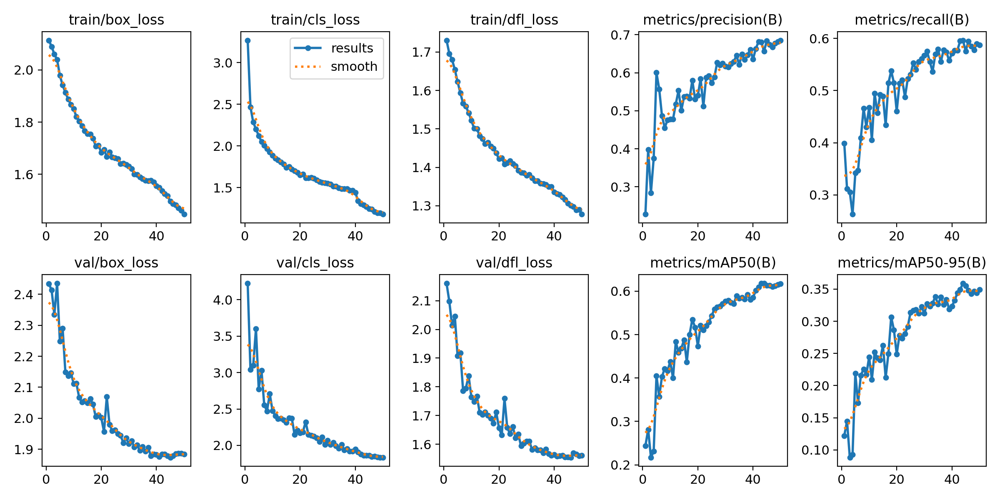
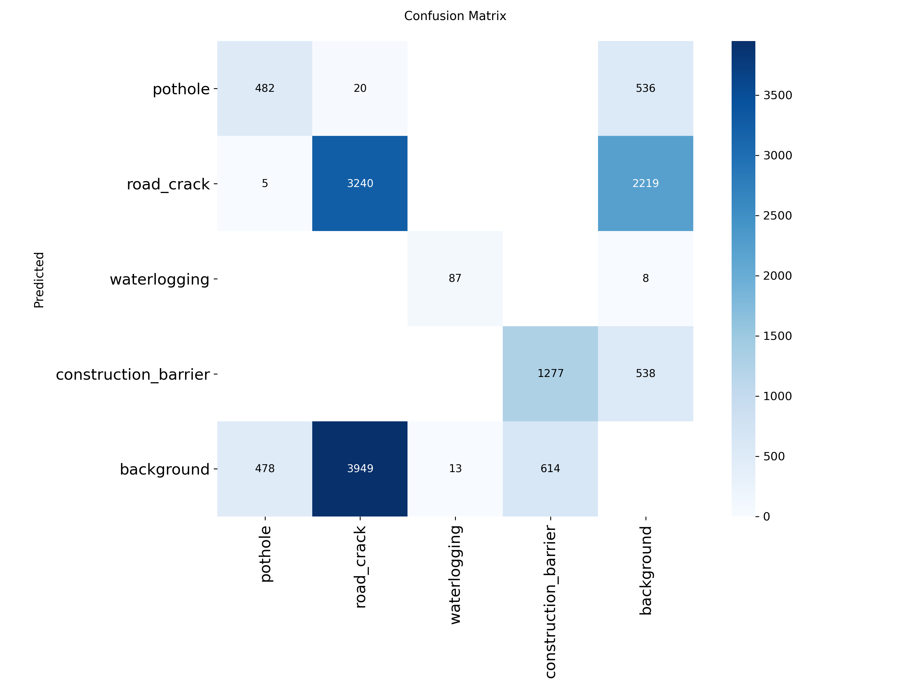
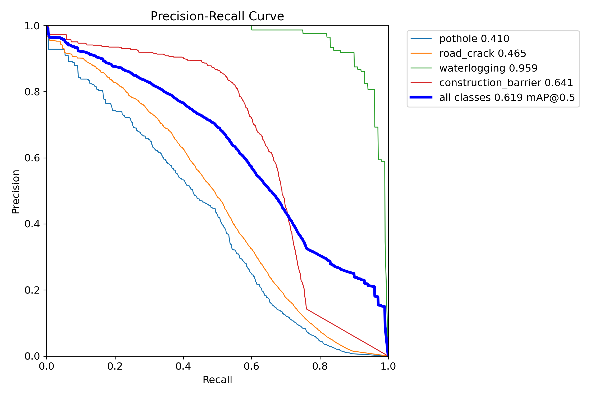
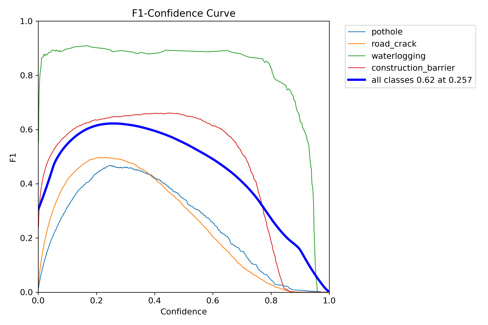

# 🛣️ Road Hazard Detection System (YOLO11)

An intelligent, real-time computer vision system for identifying critical road hazards to enhance road safety, autonomous navigation, and infrastructure maintenance. Built and optimized with **YOLO11** on a multi-source, class-balanced dataset.

---

## 📌 Project Overview

Road safety and timely road maintenance require robust automated detection of diverse road hazards. This project detects four key hazard categories under diverse weather, lighting, and camera perspectives:

| Class ID | Hazard Category | Description | Source Dataset |
| :--- | :--- | :--- | :--- |
| **0** | **Pothole** | Depressions, cavities, and structural holes in the road surface | RDD2022 |
| **1** | **Road Crack** | Longitudinal, transverse, and alligator cracks | RDD2022 |
| **2** | **Waterlogging** | Standing water, puddles, and flooded roadway sections | FloodDET |
| **3** | **Construction Barrier** | Traffic cones, barrels, and safety work-zone barriers | Roadwork Cones |

---

## 📊 Baseline Model Performance (50 Epochs)

The baseline model was trained for **50 epochs** using `yolo11n.pt` with domain-specific augmentations (geometric sanity constraints: 0° vertical flip, restricted perspective distortion to preserve ground-plane perspective).

### **Overall Validation Metrics**
* **mAP@50**: **61.70%** *(Peak: **61.81%** at Epoch 44)*
* **mAP@50-95**: **34.93%** *(Peak: **35.89%** at Epoch 44)*
* **Precision**: **68.56%**
* **Recall**: **58.72%**
* **Total Training Time**: ~72.6 minutes on single GPU

### **Key Metrics & Loss Visualizations**
The full training metrics log is available at [`runs/detect/baseline/results.csv`](runs/detect/baseline/results.csv).

| Metric Curve | Confusion Matrix |
| :---: | :---: |
|  |  |

| Precision-Recall Curve | F1-Confidence Curve |
| :---: | :---: |
|  |  |

---

## 🗂️ Dataset Architecture & Engineering

Combining datasets across disparate domains presents extreme class imbalances and disparate annotation schemas:
1. **RDD2022**: Multi-country roadway damage dataset (Japan, India, Czech, Norway, US, China). Provides pothole (`D40`) and crack (`D00`, `D10`, `D20`) annotations.
2. **FloodDET**: COCO-formatted waterlogging and urban flood imagery. Converted to YOLO format with bounding box clamping and identical-image deduplication across splits.
3. **Roadwork Cones**: Traffic work-zone hazard dataset containing cones, bollards, and construction obstacles.

### **Class Balancing Strategy**
* **Crack Subsampling**: RDD2022 contains an overwhelming majority of crack annotations. Crack-only images were stratified and subsampled to **2,250** images while strictly preserving multi-country geographical distributions.
* **Negative Background Frames**: Included ~1,000 negative/background images (clean roads without hazards) from all three sources to suppress false positive background triggers.
* **Minority Oversampling**: Applied a 7x dynamic exposure weighting in `train.txt` for rare waterlogging instances and 1.5x for potholes to counter severe frequency disparities.

Detailed dataset analysis and repair logs are documented in [`reports/`](reports/).

---

## 📁 Repository Structure

```text
RoadHazardProject/
├── configs/
│   └── data.yaml                   # YOLO dataset configuration
├── reports/
│   ├── class_distribution.csv      # Raw vs processed class distribution
│   ├── class_imbalance_report.txt  # Imbalance analysis & mitigation strategy
│   ├── dataset_repairs_report.txt  # Bounding box repairs & format alignment
│   ├── dataset_inspection_report.txt
│   └── flooddet_processing_report.txt
├── runs/
│   └── detect/
│       └── baseline/               # Baseline model checkpoint & evaluation plots
│           ├── weights/
│           │   └── best.pt         # Best trained YOLO11n weights (mAP50: 61.7%)
│           ├── results.csv         # Per-epoch training/validation metrics
│           ├── results.png         # Loss and mAP progression plots
│           ├── confusion_matrix.png
│           └── BoxPR_curve.png
├── src/
│   ├── train.py                    # Configurable YOLO11 training script
│   ├── evaluate.py                 # Split evaluation with per-class report
│   ├── predict.py                  # Real-time inference on images/videos/webcam
│   ├── prepare_dataset.py          # Stratified sampling & oversampling pipeline
│   ├── process_datasets.py         # RDD2022 & RoadworkCones cleaning
│   └── process_flooddet.py         # FloodDET COCO conversion & deduplication
├── .gitignore                      # Excludes ~43GB raw imagery & temporary files
├── requirements.txt                # Python environment dependencies
└── README.md                       # Project documentation
```

---

## 🚀 Getting Started

### 1. Installation

Clone the repository and install dependencies:

```bash
git clone https://github.com/shekhar2503/RoadHazardProject.git
cd RoadHazardProject

# Create and activate a virtual environment (optional)
python -m venv venv
# On Windows:
venv\Scripts\activate
# On Linux/macOS:
source venv/bin/activate

# Install requirements
pip install -r requirements.txt
```

---

### 2. Running Inference (Prediction)

Use the trained baseline model ([`runs/detect/baseline/weights/best.pt`](runs/detect/baseline/weights/best.pt)) to detect hazards on an image, video file, folder, or webcam:

```bash
# Run on a single image
python src/predict.py --weights runs/detect/baseline/weights/best.pt --source path/to/image.jpg

# Run on a video
python src/predict.py --weights runs/detect/baseline/weights/best.pt --source path/to/road_video.mp4

# Run on live webcam
python src/predict.py --weights runs/detect/baseline/weights/best.pt --source 0
```

---

### 3. Evaluating the Model

Evaluate the trained checkpoint on the validation or test split:

```bash
# Evaluate on test split
python src/evaluate.py --weights runs/detect/baseline/weights/best.pt --split test

# Evaluate on validation split
python src/evaluate.py --weights runs/detect/baseline/weights/best.pt --split val

# Evaluate on both splits
python src/evaluate.py --weights runs/detect/baseline/weights/best.pt --split both
```

---

### 4. Training

To train the model from scratch or fine-tune:

```bash
python src/train.py \
  --data configs/data.yaml \
  --model yolo11n.pt \
  --epochs 50 \
  --batch 32 \
  --imgsz 640 \
  --project runs/detect \
  --name custom_run
```

---

## 🛠️ Tech Stack
* **Model**: [Ultralytics YOLO11](https://github.com/ultralytics/ultralytics)
* **Framework**: PyTorch & Torchvision
* **Image & Data Processing**: OpenCV, NumPy, Pandas, Pillow, PyYAML
* **Visualization**: Matplotlib, Seaborn

---

## 📜 License
This project is open-sourced under the MIT License for educational and research purposes.
